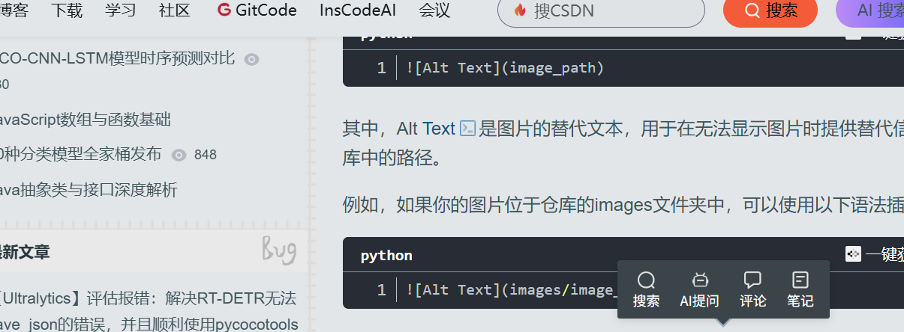

---

---
---
<mark style="background: #FFB8EBA6;">obsidian</mark> 的第一个插件 <mark style="background: #FFB8EBA6;">auto-git</mark> 初版功能完成，提供一个命令：弹出窗口，输入 <mark style="background: #FFB8EBA6;">git</mark> 的 `commit message`，点击按钮提交文档到 `github`

* 更新了 output modal 的样式
* 