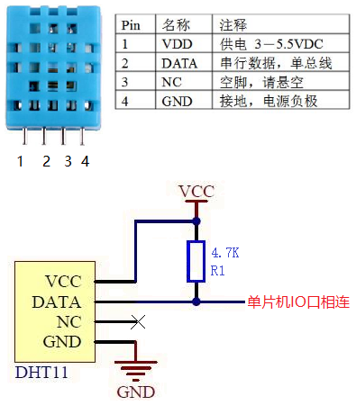
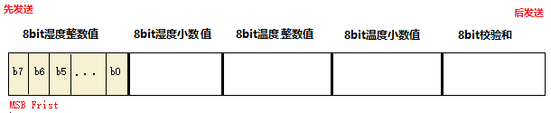
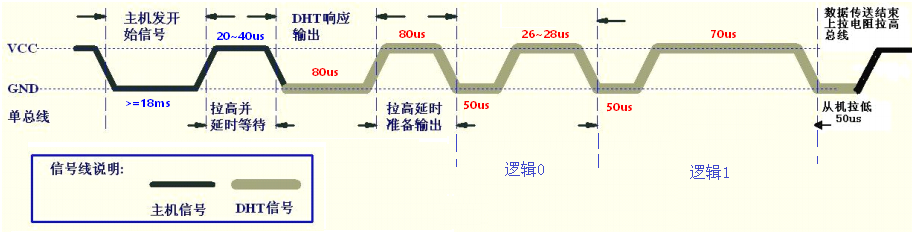

##### 1 引脚
DHT11 使用单一总线通信，即 DATA 引脚和单片机连接的线。总线总是处于空闲状态和通信状态这个2个状态之间。数据总线 DATA 使用上拉电阻拉高，因此总线空闲时为高电平，上拉电阻阻值推荐 4.7K ~ 5.1K。必要时在 VDD 和 GND 之间并联一个 100nF 去耦电容。

##### 2 时序
当单片机没有与DHT11交互时，总线处于空闲状态，在上拉电阻的作用下，处于高电平状态。
当单片机和DHT11正在通信时，总线处于通信状态，一次完整的通信过程如下：
①单片机将驱动总线的IO配置为输出模式。准备向DHT11发送数据。
②单片机将总线拉低至少18ms，以此来发送起始信号。再将总线拉高并延时20 ~ 40us，以此来代表起始信号结束。
③单片机将驱动总线的IO配置为输入模式，准备接收DHT11回传的数据。
④当DHT11检测倒单片机发送的起始信号后，就开始应答，回传采集到的传感器数据。DHT11先将总线拉低80us作为对单片机的应答（ACK），然后接着将总线拉高80us，准备回传采集到的温湿度数据。温湿度数据以固定的帧格式发送，具体格式如下图：
    
可以发现一帧为40个bit，而每一个bit的传输时序逻辑为：每一个bit都以50us的低电平（DHT11将总线拉低）为先导，然后紧接着DHT11拉高总线，如果这个高电平持续时间为26 ~ 28us，则代表逻辑0，如果持续70us则代表逻辑1。
⑤当一帧数据传输完成后，DHT11释放总线，总线在上拉电阻的作用下再次恢复到高电平状态。 

##### 3 注意
* DHT11上电后，要等待 1秒 以越过不稳定状态，在此期间不能发送任何指令。
* DHT11属于低速传感器，两次通信请求之间的间隔时间不能太短，一般来说要不能低于1秒。 
* 当前DHT11通信帧的小数部分默认都是0，厂商预留给以后实现。所以一般只读取整数值部分即可。校验和定义为：前4个Byte的总和的低8位。