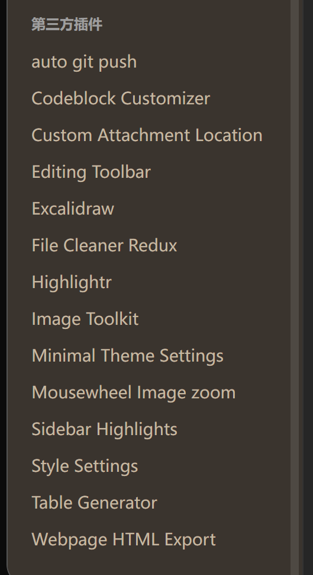
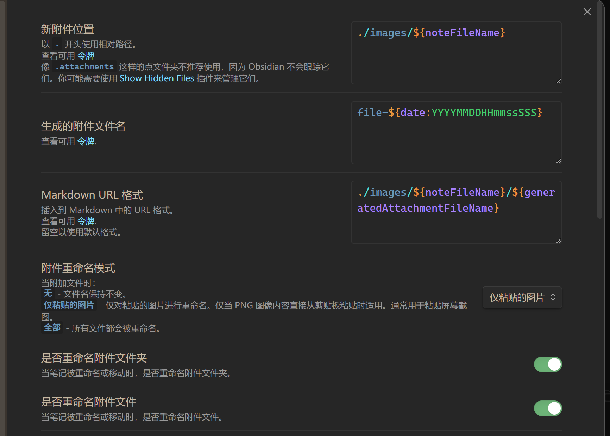
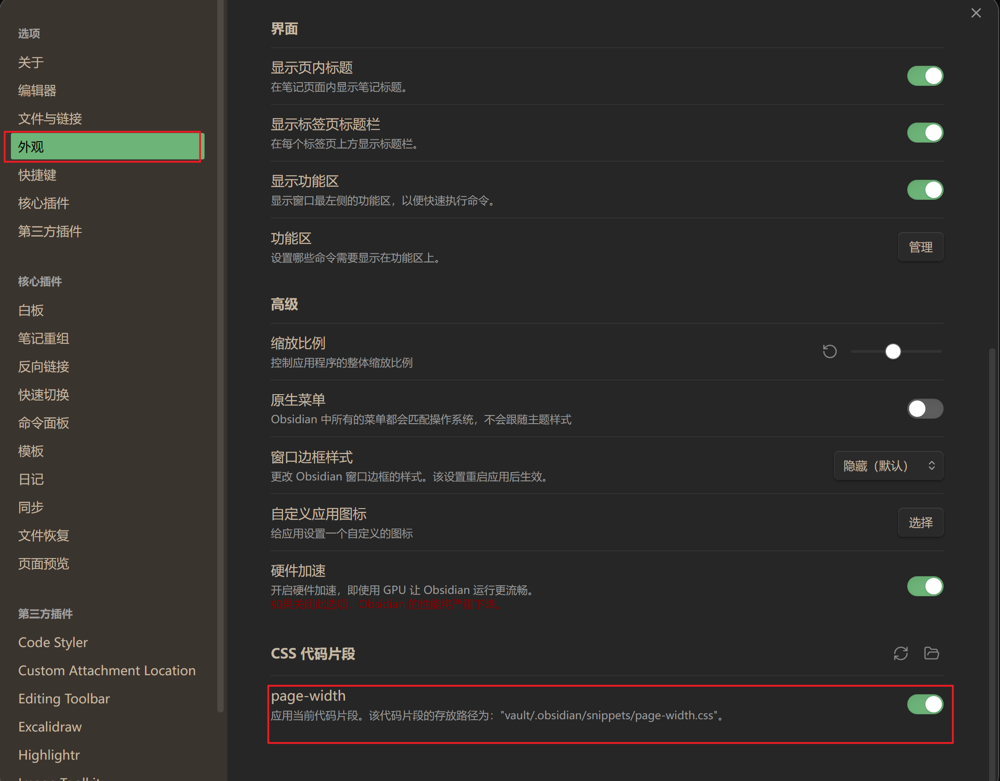

---

---
---
#### 插件

* Custom Attach Location设置

#### 配置文件
* 页面宽度设置
在如下的位置添加页面宽度的样式文件 <mark style="background: #FFB8EBA6;">page-width.css</mark>
```
body {

--file-line-width: 70rem; # 默认值为 45rem

}
```
